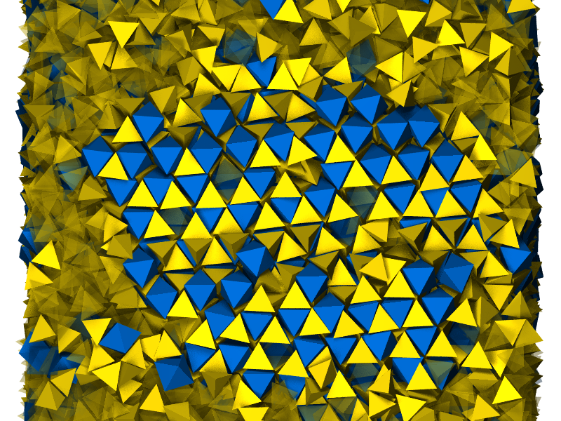

# Overview

This repository is intended to highlight visually-interesting examples of systems rendered using [plato](https://plato-draw.readthedocs.io). Note that these are more "rough and dirty," but realistically useful, scenes; for simpler examples, refer to the [plato test demo scenes](https://github.com/glotzerlab/plato/blob/master/test/test_scenes.py).

Live examples are available through [mybinder.org](https://mybinder.org/v2/gh/glotzerlab/plato-gallery/master), although it may be preferable to run more complex examples on your own computer.

For ease of use, data are currently stored directly in the repository alongside the notebooks to render them.

Examples use the [libgetar](https://github.com/glotzerlab/libgetar) library for storing trajectory data. Some examples compute things using the [freud](https://github.com/glotzerlab/freud) library.

# Gallery Images

## Binary tetrahedra-octahedra crystal

This notebook generates an image similar to that found in a Soft Matter cover associated with the paper [Self-assembly of a space-tessellating structure in the binary system of hard tetrahedra and octahedra](http://pubs.rsc.org/en/content/articlelanding/2016/sm/c6sm01180b) by Cadotte, Dshemuchadse, Damasceno, Newman, and Glotzer.

## Protein

This notebook renders a cartoon-style image of the protein [glutathione s-transferase](https://www.rcsb.org/structure/1AQW).

## Hexatic Polygons

These are data from the study [Shape and Symmetry Determine Two-Dimensional Melting Transitions of Hard Regular Polygons](https://dx.doi.org/10.1103/PhysRevX.7.021001). A selection of the data from the paper are available at [Deep Blue](https://deepblue.lib.umich.edu/data/concern/generic_works/rb68xb988?locale=en) under the [Creative Commons Attribution 4.0 license](https://creativecommons.org/licenses/by/4.0/legalcode).

The hexatic order parameter $\psi_6$ for each particle is computed using [freud](https://bitbucket.org/glotzer/freud). The angle of $\psi_6$ for each particle, corresponding to the orientation of each particle's nearest 6-neighbor environment, is mapped to the color for the particle.

## Active Squares

This notebook renders a set of rotationally-driven, rounded squares using the Discrete Element Method (DEM) component of [hoomd-blue](https://glotzerlab.engin.umich.edu/hoomd-blue/). Particles are colored according to the orientation of their hexatic order parameter $\psi_6$ by [freud](https://glotzerlab.engin.umich.edu/freud/), showing the hexagonally-ordered domains of the crystal.

## Contact-triggered Active Particles

These results are from the paper [Tunable emergent structures and traveling waves in mixtures of passive and contact-triggered-active particles](https://dx.doi.org/10.1039/C7SM00888K) by Agrawal, Bruss, and Glotzer. In this image, contact-triggered active particles (red) and passive particles (blue) assemble two different ordered structures.

## Crystallization

This notebook shows a process of nucleation and growth of a somewhat complex crystal structure ($tP30-\text{CrFe}$). Individual particles were identified as being in the fluid or solid phase using [pythia](https://pythia-learn.readthedocs.io).

